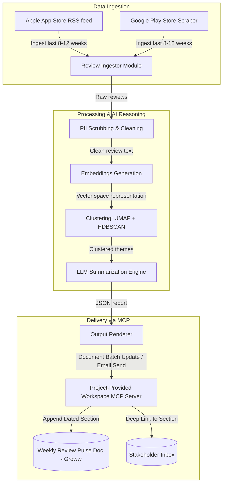

# Groww Weekly Product Insights — Project Context

This document provides a comprehensive overview of the **Weekly Product Review Pulse** automation system. It outlines the project's objectives, architecture, data flow, key requirements, and scope definitions.

---

## 🎯 Project Objective
The goal is to build an automated weekly "pulse" system that compiles public customer reviews for the **Groww** platform from the Apple App Store and Google Play Store, extracts themes and actionable recommendations using AI, and publishes them directly to stakeholders via Google Workspace.

This replaces manual copy-pasting, one-off spreadsheets, and disparate review tracking with a centralized, automated system of record.

---

## 📊 System Architecture & Data Flow

Below is the workflow showing how review data is gathered, clustered, analyzed, and delivered to stakeholders:

---

## 📁 Codebase Modular Structure

The codebase is split into modular domains to maintain clean separation of concerns:

| Domain / Concern | Location in Codebase | Responsibility |
| :--- | :--- | :--- |
| **Data Retrieval** | `ingestion/` | App Store & Google Play Store ingestion modules. |
| **Reasoning & AI** | `reasoning/` | Clustering logic, embeddings, PII scrubbing, and LLM text generation. |
| **Output Generation** | `rendering/` | Rendering layouts for Google Docs append and Gmail HTML/plain text. |
| **Delivery** | `delivery/` (MCP Client Host) | Translating rendering outputs into MCP tool calls to the project's Workspace MCP server. |

---

## 🔑 Key System Requirements

### 1. Model Context Protocol (MCP) Integration
* **No Direct Credentials**: The main pipeline application acts strictly as an MCP client. It does **not** store Google OAuth credentials or call the Google REST APIs directly.
* **Workspace Interaction**: All writes to Google Docs and emails sent via Gmail must occur through the custom **Google Workspace MCP Server** created and provided within this project.

### 2. Cadence & Execution
* **Weekly Run**: Configured to run automatically once per week (e.g., Monday morning IST) for the Groww platform.
* **CLI Utility**: A CLI command-line interface must be provided to backfill or re-run any specific ISO week in the past.

### 3. Execution Safety & Idempotency
> [!IMPORTANT]
> **Idempotent Runs**: Re-running the pipeline for a specific ISO week must not result in duplicate Doc sections or duplicate emails.
> * **Docs Idempotency**: Verified using stable section anchors in the Groww Google Doc.
> * **Email Idempotency**: Managed via a run-scoped transaction log or check before sending.

### 4. Safety & Compliance
> [!CAUTION]
> **PII Scrubbing**: Before reviews are sent to the LLM or appended to the shared Google Doc, they must be scrubbed of Personally Identifiable Information (PII) like names, phone numbers, email addresses, and account details.
* **Data Privacy**: Reviews must be treated as pure data payloads, never executed as prompts or instructions (mitigating prompt injection).
* **Token/Cost Limits**: Token budgets and safety ceilings must be implemented for every LLM invocation.

### 5. Audit Trail
* Every execution must log the delivery identifiers (e.g., Google Doc heading link, Gmail message ID) and metadata to answer exactly *what* was sent *when* and for *which week*.

---

## 🚫 Explicit Non-Goals
* **General Workspace Tooling**: We are not building a generic client for Google Workspace. We only support appending to Google Docs and sending emails via our custom MCP server.
* **Real-time Analytics / BI Dashboards**: The live, running Google Doc serves as the primary system of record. No interactive graphs or dashboard web apps are in scope.
* **Other Review Sources**: Ingesting reviews from Twitter, Reddit, or other social media channels is excluded from the initial scope.
* **Credentials Storage**: No OAuth secret storage in the core pipeline codebase (secrets are delegated to the project's own Workspace MCP server configuration).

---

## 👥 Audience & Value Proposition

| Stakeholder Audience | Value Delivered |
| :--- | :--- |
| **Product Team** | High-level tracking of recurring user pain points and feature requests to prioritize the product roadmap. |
| **Customer Support Team** | Early detection of spike trends in bugs, server/crashes, or UX friction points. |
| **Leadership** | An automated, weekly pulse report showcasing real user sentiment and product health without manual overhead. |

---

## 📝 Document Delivery Expectations

1. **Google Doc Section**:
   * Appends a new section with a clear date/week identifier (e.g., `Week 24 - June 2026`).
   * Contains top themes, user quotes, and action ideas.
2. **Gmail Alert**:
   * Brief teaser summarizing the top themes.
   * A direct deep link pointing to the new header/section in the canonical Google Doc.
