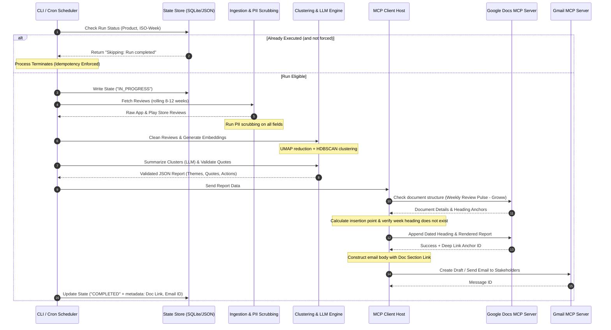

# Groww Weekly Product Insights — Detailed System Architecture

This document describes the technical architecture, data models, integration patterns, and components of the **Weekly Product Review Pulse** system, built exclusively for the **Groww** platform.

---

## 1. Architectural Overview & Design Philosophy

The system is designed as a modular, state-monitored, data processing pipeline. Its main goal is to safely transform raw user review feeds into structured, actionable product intelligence for the Groww app without storing user credentials or utilizing ad-hoc API integrations in the main pipeline logic. This is achieved using a custom Google Workspace MCP server developed and provided directly within this project.

```
┌────────────────────────────────────────────────────────────────────────┐
│                              CLI / Cron                                │
└───────────────────────────────────┬────────────────────────────────────┘
                                    │ triggers
                                    ▼
┌────────────────────────────────────────────────────────────────────────┐
│                          Data Ingestion Core                           │
│           (App Store RSS Client + Google Play Scraper)                 │
└───────────────────────────────────┬────────────────────────────────────┘
                                    │ raw review feeds
                                    ▼
┌────────────────────────────────────────────────────────────────────────┐
│                         Security & PII Scrubbing                       │
│        (Regex filters + Named Entity Masking for user safety)          │
└───────────────────────────────────┬────────────────────────────────────┘
                                    │ cleaned review data
                                    ▼
┌────────────────────────────────────────────────────────────────────────┐
│                       Clustering & NLP Engine                          │
│        (Embeddings Gen -> UMAP Reduction -> HDBSCAN Clustering)         │
└───────────────────────────────────┬────────────────────────────────────┘
                                    │ grouped clusters
                                    ▼
┌────────────────────────────────────────────────────────────────────────┐
│                   LLM Reasoning & Quote Validator                      │
│        (Theme Summarization & Exact String Matching on Quotes)         │
└───────────────────────────────────┬────────────────────────────────────┘
                                    │ validated insights JSON
                                    ▼
┌────────────────────────────────────────────────────────────────────────┐
│                            Output Renderer                             │
│         (Google Docs Payload + Gmail HTML & Deep Link Parser)          │
└───────────────────────────────────┬────────────────────────────────────┘
                                    │ structured templates
                                    ▼
┌────────────────────────────────────────────────────────────────────────┐
│                           MCP Host Interface                           │
│     (Communicates with Project-Provided Google Workspace MCP Server)   │
└───────────────────────────────────┬────────────────────────────────────┘
                                    │
                                    ▼ tool calls (Docs & Gmail)
                      ┌───────────────────────────┐
                      │    Custom Workspace MCP   │
                      │   (Embedded in Project)   │
                      └─────────────┬─────────────┘
                                    │
                  ┌─────────────────┴─────────────────┐
                  ▼                                   ▼
┌───────────────────────────┐           ┌───────────────────────────┐
│ Weekly Review Doc (Groww) │           │     Stakeholder Email     │
└───────────────────────────┘           └───────────────────────────┘
```

---

## 2. Sequence Lifecycle

The diagram below outlines the exact end-to-end processing sequence, showcasing state-checking for idempotency and the separation of client logic from the MCP server interfaces.



---

## 3. Detailed Component Breakdown

### 3.1 Data Ingestion & PII Cleaning

* **App Store Ingestor**: Connects to the App Store Customer Reviews RSS endpoint.
* **Google Play Ingestor**: Scrapes active reviews via dynamic pagination.
* **PII Scrubbing**: Applied globally prior to vectorization.
  * *Regex Filters*: Strip phone numbers, email addresses, credit/debit card patterns, and PAN/Aadhaar formats.
  * *Named Entity Masking*: Identifies and masks potential customer names or usernames with generic tokens (e.g., `[USER_NAME]`).

### 3.2 Clustering & NLP Core (Reasoning)

* **Embedding Model**: Translates review text into dense vector representations.
* **UMAP (Uniform Manifold Approximation)**: Reduces dimensionality to prepare coordinates for density-based grouping.
* **HDBSCAN**: Identifies high-density clusters corresponding to customer issues, separating outliers as noise.
* **LLM Theme & Action Synthesis**:
  * Feeds clustered reviews to the LLM formatted as static data payloads.
  * LLM names themes, extracts key user issues, and formulates action items.
* **Quote Validation Engine**:
  * Prior to finalizing the report, the engine cross-references the LLM-selected user quotes against the raw review database.
  * **Strict Policy**: Any quote that does not have an exact string match (case-insensitive) in the source reviews is rejected, prompting the engine to fall back or re-query to prevent hallucinations.

### 3.3 Output Renderer

* **Google Docs Payload Generator**: Computes the structural updates using the Google Docs batch update schema.
* **Email Builder**: Compiles plain text and HTML emails containing:
  * Summary of the week's top themes.
  * High-priority bugs highlighted.
  * A canonical Markdown link pointing to the specific Google Doc heading anchor.

### 3.4 MCP Client Integration

The system relies on Model Context Protocol (MCP) tool calls, acting as a client to a custom, project-provided Google Workspace MCP server:

1. **Google Docs Tooling**: Interacts with the custom MCP server to update document bodies, query outline hierarchies, and locate sections in the Groww review pulse document.
2. **Gmail Tooling**: Interacts with the custom MCP server to draft, send, and search notification emails.

---

## 4. State Management & Idempotency

To prevent duplicated documents and emails during scheduled cron executions or manually triggered backfills, the system uses a persistent **State Store** (local SQLite database or JSON tracker).

### Execution Log Table Schema

| Column Name | Data Type | Description |
| :--- | :--- | :--- |
| `id` | INTEGER (PK) | Auto-incrementing identifier. |
| `product` | TEXT | Product identifier (e.g., `groww`). |
| `iso_week` | TEXT | Year and week tracker (e.g., `2026-W24`). |
| `status` | TEXT | `IN_PROGRESS`, `COMPLETED`, or `FAILED`. |
| `execution_time` | TIMESTAMP | Time of pipeline execution. |
| `doc_id` | TEXT | Target Google Doc Identifier. |
| `heading_anchor_id` | TEXT | Created Doc heading ID for direct linking. |
| `email_message_id` | TEXT | Reference of the sent notification email. |

---

## 5. Data Models & Schemas

### 5.1 Review Object (Cleaned Schema)

```json
{
  "id": "string (unique hash)",
  "platform": "string (appstore | playstore)",
  "author": "string (scrubbed)",
  "date": "string (ISO 8601)",
  "rating": "integer (1-5)",
  "review_text": "string (scrubbed of PII)",
  "app_version": "string | null"
}
```

### 5.2 Insight Report Schema

```json
{
  "product": "string",
  "iso_week": "string",
  "period_start": "string (date)",
  "period_end": "string (date)",
  "themes": [
    {
      "id": "string",
      "theme_name": "string",
      "severity": "string (HIGH | MEDIUM | LOW)",
      "review_count": "integer",
      "summary": "string",
      "quotes": ["string (exact matches)"],
      "action_ideas": ["string"]
    }
  ]
}
```

---

## 6. Operation & Deployment Configurations

### 6.1 CLI Execution

The system is executed via npm commands or direct script executions:

```bash
# Standard scheduled execution (Runs current week calculations)
npm run pulse -- --product=groww

# Backfill a historical ISO week
npm run pulse -- --product=groww --week=2026-W22 --force
```

### 6.2 Host MCP Configuration

The local agent environment links to the custom Google Workspace MCP server provided directly within this project folder via `mcp_config.json`:

```json
{
  "mcpServers": {
    "groww-workspace-mcp": {
      "command": "node",
      "args": ["/Users/samirkhan/Nextleap Projects/Groww Weekly Product Insights/mcp-server/index.js"],
      "env": {
        "GOOGLE_APPLICATION_CREDENTIALS": "/Users/samirkhan/Nextleap Projects/Groww Weekly Product Insights/mcp-server/credentials.json"
      }
    }
  }
}
```

> [!NOTE]
> The custom Workspace MCP server handles all Google API authorizations internally using project-level credentials. The core CLI and ingestion modules of the `Groww Weekly Product Insights` project remain entirely decoupled from direct Google API keys and credentials.
